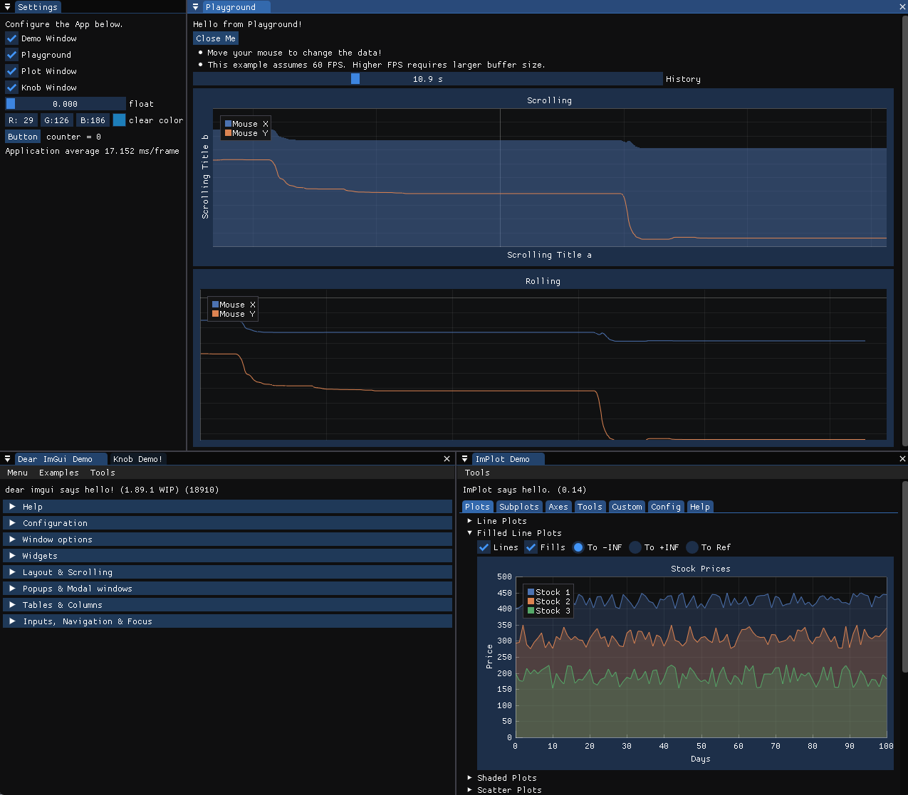

# Dear ImGui with GLFW + OpenGL3

[**Dear ImGui**](https://github.com/ocornut/imgui) is a bloat-free graphical user interface library for C++. It outputs optimized vertex buffers that you can render anytime in your 3D-pipeline-enabled application. It is fast, portable, renderer agnostic, and self-contained (no external dependencies).

*This sample uses Dear ImGui with GLFW + OpenGL3*

[**GLFW**](https://www.glfw.org/) (Graphics Library Framework) is an Open Source, multi-platform library for OpenGL, OpenGL ES and Vulkan development on the desktop. It provides a simple API for creating windows, contexts and surfaces, receiving input and events.

[**OpenGL**](https://www.opengl.org/) (Open Graphics Library) is a cross-language, cross-platform application programming interface (API) for rendering 2D and 3D vector graphics. The API is typically used to interact with a graphics processing unit (GPU), to achieve hardware-accelerated rendering.

## Install and Configure
### On Windows
Install dependencies using [vcpkg - (VC++ Package Manager)](https://vcpkg.io/en/index.html) 
```bash
# Clone this repository
> git clone https://github.com/sukesh-ak/ImGui-GLFW-OpenGL3
> cd ImGui-GLFW-OpenGL3

# Clone/Install VC++ Package Manager
> git clone https://github.com/Microsoft/vcpkg.git

# Run the bootstrap script to build vcpkg
> .\vcpkg\bootstrap-vcpkg.bat

# Install dependencies required for this project
> .\vcpkg\vcpkg.exe install imgui[core,win32-binding,docking-experimental,glfw-binding,opengl3-binding]:x64-windows

# Using vcpkg with MSBuild / Visual Studio (may require elevation)
> .\vcpkg\vcpkg.exe integrate install

# Compile and Run
> cmake . -B build/
> cmake --build build
> build\Debug\ImGui-GLFW-OpenGL3.exe

```
We are ready to open the project in Visual Studio and Run too!


### On Linux/WSL2
Install dependencies using [vcpkg - (VC++ Package Manager)](https://vcpkg.io/en/index.html) 

```bash
# Clone this repository
> git clone https://github.com/sukesh-ak/ImGui-GLFW-OpenGL3
> cd ImGui-GLFW-OpenGL3

# Clone/Install VC++ Package Manager
> git clone https://github.com/Microsoft/vcpkg.git

# Run the bootstrap script to build vcpkg
> ./vcpkg/bootstrap-vcpkg.sh

# Install dependencies required for this project
> sudo apt install libxinerama-dev libxcursor-dev xorg-dev libglu1-mesa-dev pkg-config

> ./vcpkg/vcpkg install imgui[core,docking-experimental,glfw-binding,opengl3-binding]:x64-linux

# Compile and Run
> cmake . -B build/ 
> cmake --build build
> ./build/ImGui-GLFW-OpenGL3

```
That's it!

### Screenshot
  

## Docs and Helpful links
- Live Documentation [here](https://pthom.github.io/imgui_manual_online/manual/imgui_manual.html)
- Docs on Examples [here](https://github.com/ocornut/imgui/blob/master/docs/EXAMPLES.md)
- Wiki with examples and usage [here](https://github.com/ocornut/imgui/wiki)
- Useful Extensions [here](https://github.com/ocornut/imgui/wiki/Useful-Extensions)
## Credits
- Dear ImGui - https://github.com/ocornut/imgui  
- GLFW - https://www.glfw.org/  
- OpenGL - https://www.opengl.org/  
- ImPlot - https://github.com/epezent/implot  
- ImGui Knobs - https://github.com/altschuler/imgui-knobs  
- ImSpinner - https://github.com/dalerank/imspinner


